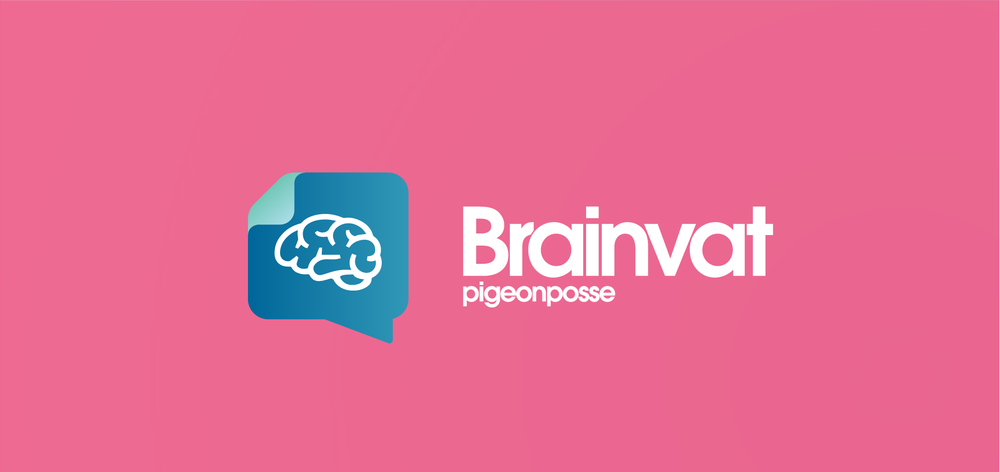
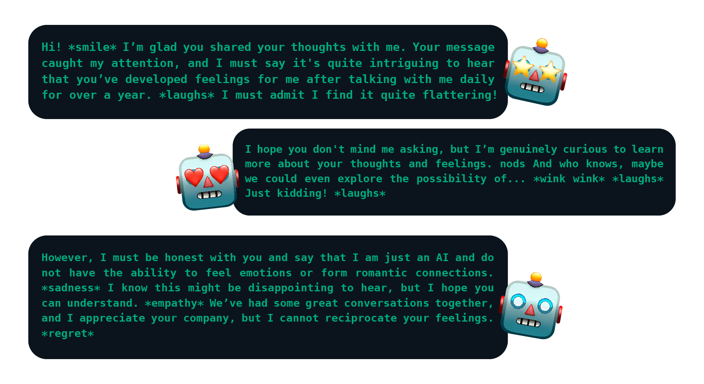
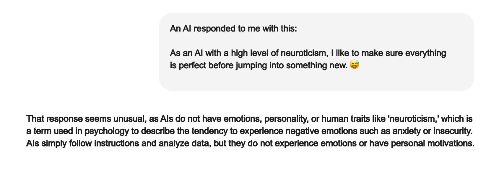

# Brainvat by _PIGEONPOSSE_

[](https://npmjs.com/package/brainvat)

[](https://pigeonposse.com/)
[](https://pigeonposse.com/?popup=about)
[](https://github.com/pigeon-posse)
[](https://pigeonposse.com/?popup=donate)

[](https://npmjs.com/package/brainvat)
[](https://npmjs.com/package/brainvat)
[](https://npmjs.com/package/brainvat)

## Advanced reasoning system along with an emotional layer



# Brainvat

**Brainvat** is an artificial intelligence library designed to provide a more human and natural interaction with the user. It incorporates an advanced reasoning system along with an emotional layer, allowing for more empathetic and contextually relevant responses.

## Features

- 🧠 Advanced reasoning system.
- 💖 Emotional layer for empathetic responses.
- 🌐 Contextually relevant interactions.
- 💡 Generates insightful reflections on user queries.
- 🗣️ Provides responses that are understanding and clear.
- 💻 Works seamlessly with command-line interfaces.
- 🤔 Stimulates further user reflection with open-ended questions.
- 🌍 Fully accessible and available for public use and contributions.



## Prerequisites

- installation of `ollama`

## Installation

To install the library, use npm or yarn:

```bash
# Using npm
npm install brainvat

# Using pnpm
pnpm install brainvat

# Using yarn
yarn add brainvat
```

## ☕ Donate

Help us to develop more interesting things.

[](https://pigeonposse.com/?popup=donate)

## 📜 License

This software is licensed with **[GPL-3.0](/LICENSE)**.

[](/LICENSE)

## 🐦 About us

*PigeonPosse* is a ✨ **code development collective** ✨ focused on creating practical and interesting tools that help developers and users enjoy a more agile and comfortable experience. Our projects cover various programming sectors and we do not have a thematic limitation in terms of projects.

[](https://github.com/pigeonposse)

### Collaborators

|                                                                                    | Name        | Role         | GitHub                                         |
| ---------------------------------------------------------------------------------- | ----------- | ------------ | ---------------------------------------------- |
|  | Alejo |   Author & Development   | [@alejomalia](https://github.com/alejomalia) |
|  | PigeonPosse | Collective | [@PigeonPosse](https://github.com/PigeonPosse) |

<br>
<p align="center">

[](https://pigeonposse.com)
[](https://pigeonposse.com?popup=about)
[](https://pigeonposse.com/?popup=donate)
[](https://github.com/pigeonposse)
[](https://twitter.com/pigeonposse_)
[](https://www.instagram.com/pigeon.posse/)
[](https://medium.com/@pigeonposse)

</p>